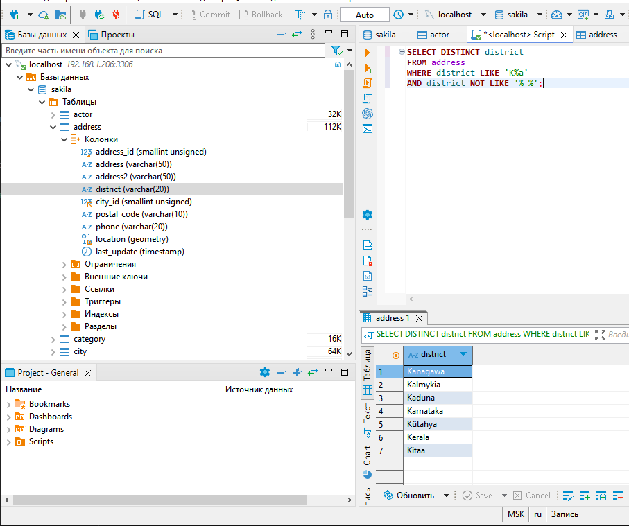
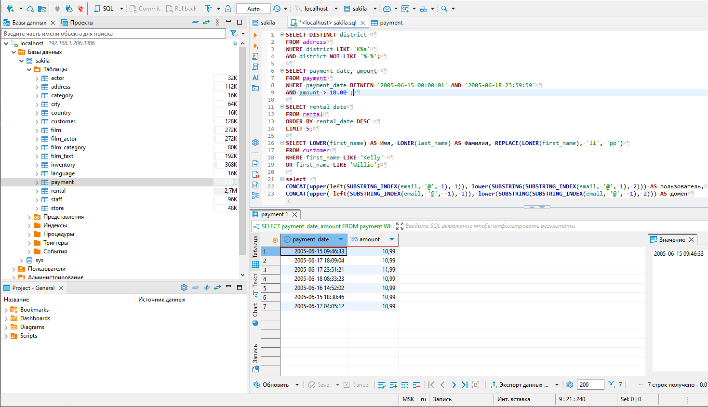
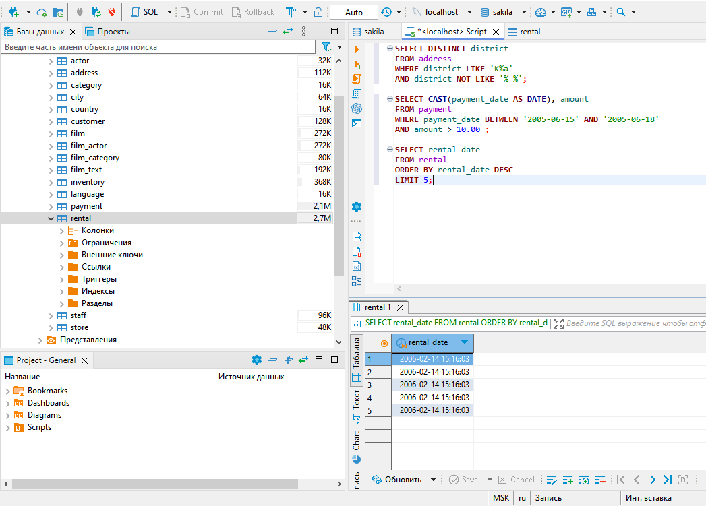
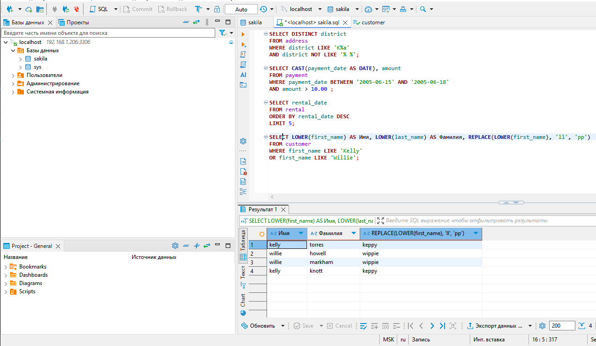
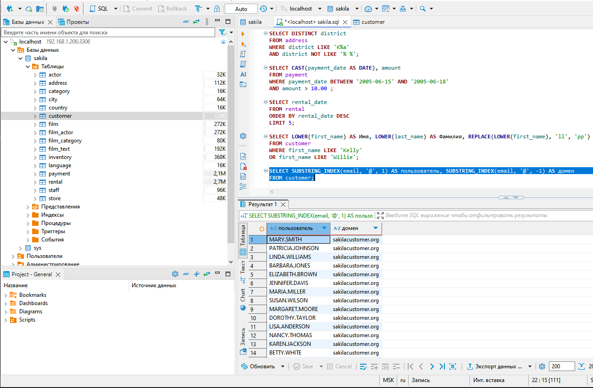
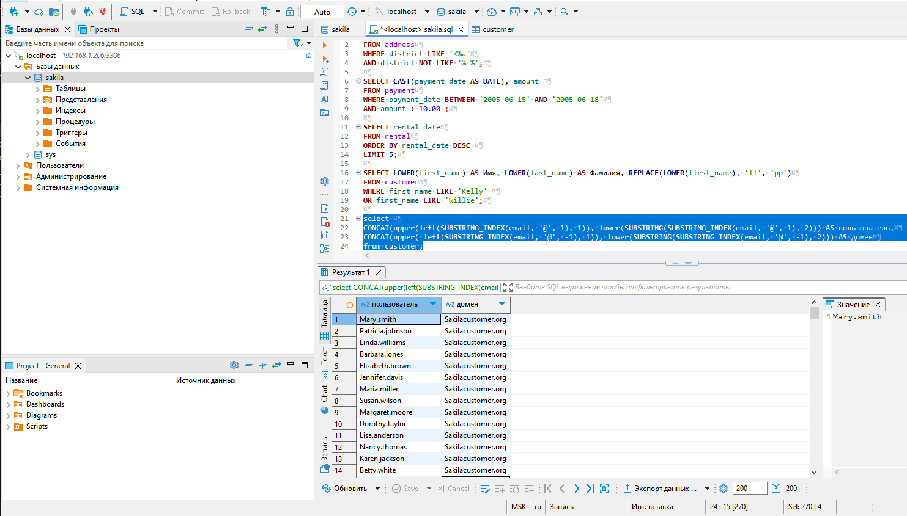

# Домашнее задание к занятию "SQL. Часть 1" - Сенотов А.С.

### Задание 1

Получите уникальные названия районов из таблицы с адресами, которые начинаются на “K” и заканчиваются на “a” и не содержат пробелов.

#### Решение

```SQL
SELECT DISTINCT district 
FROM address
WHERE district LIKE 'K%a'
AND district NOT LIKE '% %';

```



---

### Задание 2

Получите из таблицы платежей за прокат фильмов информацию по платежам, которые выполнялись в промежуток с 15 июня 2005 года по 18 июня 2005 года **включительно** и стоимость которых превышает 10.00.

#### Решение

```sql
SELECT CAST(payment_date AS DATE), amount 
FROM payment
WHERE payment_date BETWEEN '2005-06-15' AND '2005-06-18'
AND amount > 10.00 ;
```



---

### Задание 3

Получите последние пять аренд фильмов.

#### Решение

```sql
SELECT rental_date
FROM rental
ORDER BY rental_date DESC 
LIMIT 5;
```



---

### Задание 4

Одним запросом получите активных покупателей, имена которых Kelly или Willie. 

Сформируйте вывод в результат таким образом:
- все буквы в фамилии и имени из верхнего регистра переведите в нижний регистр,
- замените буквы 'll' в именах на 'pp'.

#### Решение

```sql
SELECT LOWER(first_name) AS Имя, LOWER(last_name) AS Фамилия, REPLACE(LOWER(first_name), 'll', 'pp')
FROM customer
WHERE first_name LIKE 'Kelly' 
OR first_name LIKE 'Willie';
```




### Задание 5*

Выведите Email каждого покупателя, разделив значение Email на две отдельных колонки: в первой колонке должно быть значение, указанное до @, во второй — значение, указанное после @.

#### Решение

```sql
SELECT SUBSTRING_INDEX(email, '@', 1) AS пользователь, SUBSTRING_INDEX(email, '@', -1) AS домен
FROM customer;
```


### Задание 6*

Доработайте запрос из предыдущего задания, скорректируйте значения в новых колонках: первая буква должна быть заглавной, остальные — строчными.

#### Решение

```sql
select 
CONCAT(upper(left(SUBSTRING_INDEX(email, '@', 1), 1)), lower(SUBSTRING(SUBSTRING_INDEX(email, '@', 1), 2))) AS пользователь,
CONCAT(upper( left(SUBSTRING_INDEX(email, '@', -1), 1)), lower(SUBSTRING(SUBSTRING_INDEX(email, '@', -1), 2))) AS домен
from customer;
```

